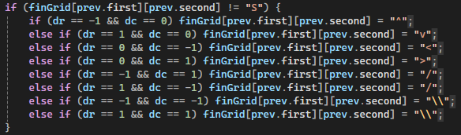

<html lang="en">
<head>
<meta charset="UTF-8" />
<meta name="viewport" content="width=device-width, initial-scale=1.0"/>
<title>C-Project Devlog — Mark Carroll</title>
<link href="https://fonts.googleapis.com/css2?family=Share+Tech+Mono&family=Barlow:wght@400;500;600&display=swap" rel="stylesheet"/>

</head>
<body>

  

    

    

    

    
C++-Project / devlog.html — Mark Carroll

  

  

    

      
ATU &nbsp;·&nbsp; C++ Project &nbsp;·&nbsp; 2026

      
# C++-Project

      

        This will serve as a development log and report for the C++ A* pathfinding project.
        The goal is to implement an A* algorithm to find the shortest route through a randomly generated maze.
      

    

    

 	    <!-- ── Entry 0 ── -->
      

        
&gt; 25/02/2026

        

          
I used GeeksforGeeks to get a basis for the A* algorithm. I'm going to split the grid elements into it's own file so that the file layout is better.

        

      

      <!-- ── Entry 1 ── -->
      

        
&gt; 04/03/2026

        

          
Working on applying concepts from the Matrices lab — specifically overloaded operators. The plan is to overload the <code>=</code> operator to duplicate the grid, so a separate copy can be printed with the path mapped out using directional characters <code>\ - / |</code>.

          
Met with Michelle today. She recommended focusing on testing for the algorithm, and keeping the overloaded operator in the codebase even if unused — it demonstrates initiative and understanding of the course material.

        

      

      <!-- ── Entry 2 ── -->
      

        
&gt; 11/03/2026

        

          
Working on the test functions. A single <code>runAllTests()</code> will run the tests. I didn't want to create a new grid for every test, so I made a default constructor. I just pass two values for an x and y axis. Making the default constructor shows that I have learned from the module and can implement my learning into my project.

          
Started on the final grid print. I've abandoned the overloaded <code>=</code> operator. It didn't end up working, as I would have had to convert the grid to const char. I instead chose to print based off of the value, # for 0, * for 1. Then I replace the values of the path taken, with characters coresponding with the direction of the path.

          
I'm having an error with, "Expression: vector subscript out of range". Currently working with AI to try and diagnose the issue. I believe there is an error with the validation function.

          
          
Turns out the issue was alot simpler than I realised. When the grid initialisation to within the A* algorithm, I didn't move the grid creation into it though. That was the only real issue. I did readdress the validation to make sure it was within bounds anyways.

          
          

            
            
// main.cpp — destination + start initialisation

          

          
I added colour to the output. This makes the output alot cleaner, and easier to read.

          

            
            
// console output — colour-coded walls, path, and open cells

          

        

      

      
      

        
&gt; 18/03/2026

        

          
I fixed the testing, as the test function for testing destination wasn't working. This means I have tests for validation, checking if the cell is a 1 or 0, and if the cell is the destination. I'm going to verify with Michelle that this is sufficient testing. I've got good tests. I'm using small unit tests which is better for catching bugs, as running the whole thing provides no granularity.

          
Met with Michelle today. She recommended focusing on testing for the algorithm, and keeping the overloaded operator in the codebase even if unused — it demonstrates initiative and understanding of the course material.

        

      

     <!-- ── Reports ── -->
      

        
Report

        

          
          

          
The way I was generating my grid, was by using <code>srand()</code> and modulo 2. This would give me either a 1 or a 0, which would be then used to fill the grid. This works, but it is "too random". It generates a grid that is very often impossible to navigate. This is why I chose to change the way the grid was generated.

          

            
            
// createGrid() — std::uniform_int_distribution&lt;int&gt;(0,1)

          

          
I talked with Nathan about the grid generation, and he pointed me in the way of the <code>random</code> library. This library gave me access to <code>uniform_int_distribution</code>. This, in combination with <code>default_random_engine</code>, allows me to create a grid with a better distribution of 1s and 0s. This makes the grid far more solvable than the <code>srand</code> grid.

          

            
          

          

            
          

          
          
In relation to issues that I currently have, and things that could be to make the project, there are a couple things. Within the A* function, I could've made a function to check the surrounding cells, instead of having it check each cell individually. This would reduce the stack size of the function, helping it run faster. I would also have liked to done more comprehensive unit tests. Testing the A* algorithm more, testing the calculations would have given me a smaller margin of error.

          
As far as AI usage goes, I used it very minimally. I chose to not use it for writing the A* algorithm, as the GeeksforGeeks example was sufficient. I also wanted to show my abilities as a developer and show the knowledge I have gained throughout the module. I made the Grid class, all of the tests and the A* without the use of AI. I did however use it for debugging purposes and for printing the final grid. The printing of the final grid with the cell details was complicated, so I employed the use of AI for it. I had to debug it's work as it would write over itself and the characters for the pathing were inverted. I did also use AI to create the HTML and CSS for this GitHub page, as HTML is one of my least favourite things to do.

        

        

            
            
// Function replacing cells with characters

          

      

      

        
References

        

          
<a href="https://www.geeksforgeeks.org/dsa/a-search-algorithm/">A* Search Algorith, GeeksforGeeks</a>

          
Anthropic, Claude (AI)

        

      

    
<!-- /entries -->

    

      
MC

      

        
Mark Carroll

        
Atlantic Technological University &nbsp;·&nbsp; C++ A* Project

      

    

  
<!-- /log-wrap -->

<!-- /page -->
</body>
</html>
